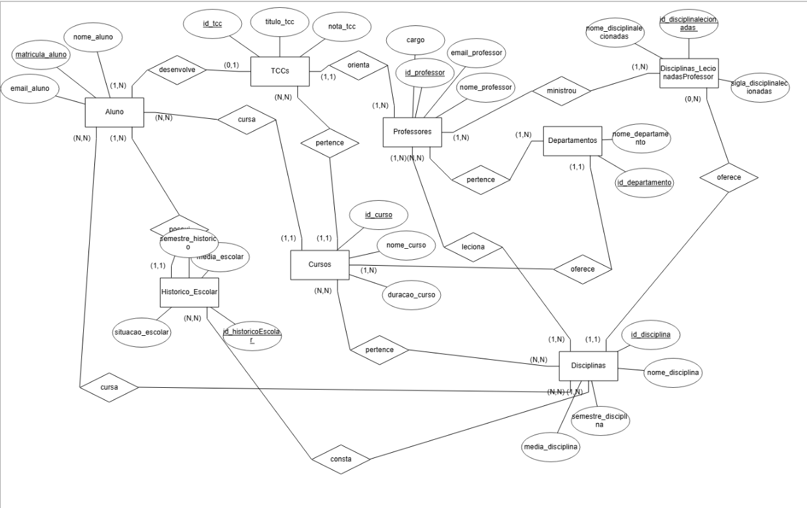
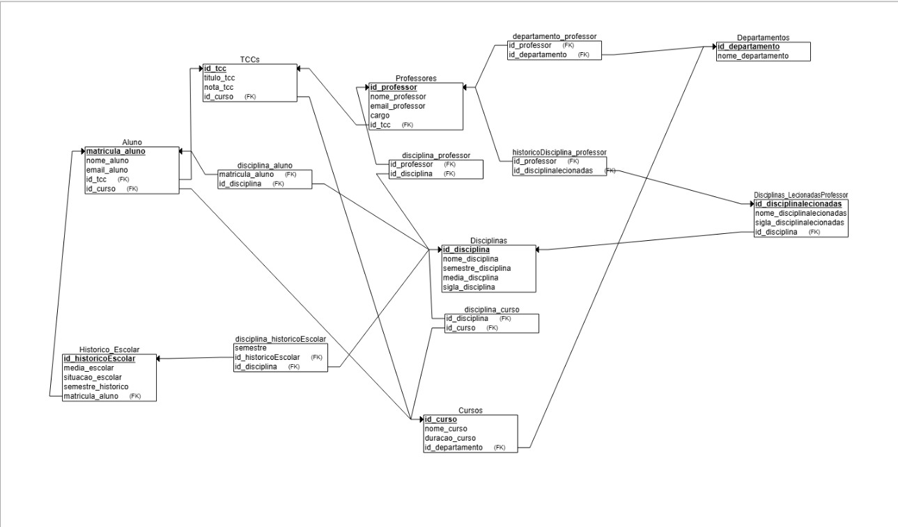

# Banco de dados para uma universidade
## 📌 Integrantes

Nome: João Pedro Sabino Garcia - RA: 22.224.032-7
Nome: Matheus Dourado Valle - RA: 22.224.023-6 

## 📖 Descrição do Projeto

Este projeto consiste em um sistema de gestão acadêmica universitária, implementado para armazenar e gerenciar informações sobre alunos, professores, cursos, disciplinas, departamentos e históricos acadêmicos.
As principais funcionalidades incluem:
- Cadastro e gestão de alunos e professores
- Gerenciamento de disciplinas associadas a cursos específicos.
- Controle acadêmico através de históricos escolares.
- Associação de professores às disciplinas ministradas.
- Consultas avançadas através de queries específicas em SQL.

## 🚀 Como Executar o Projeto

Para rodar o projeto e gerar os dados no seu banco de dados do Supabase, siga os passos detalhados abaixo:
- Certifique-se de ter o Python instalado em sua máquina, e utilize alguma plataforma para rodar o código (Visual Studio Code, Replit, etc.).
- Acesse o SupaBase como Banco de Dados para armazenar as informações geradas pelo código.
- Copie a URL do seu projeto Supabase e a chave pública (public key), pois você precisará inserir essas informações no código.
- No banco de dados, crie as tabelas a partir da querie de criação presente no repositório na pasta "QueriesTables".
- Após colocar as informações do seu banco no código, execute-o.

O script fará o seguinte automaticamente:

- Limpará as tabelas existentes no banco de dados, respeitando as relações de FK.
- Inserirá dados fictícios automaticamente (alunos, professores, departamentos, disciplinas, cursos, históricos escolares, histórico de disciplinas lecionadas por professores e TCCs).
- Fará todas as relações necessárias, conforme os requisitos e as queries.
- Exibirá no terminal um log indicando o progresso e a confirmação da execução.

Após isso:
- O banco será capaz de executar no SQL Editor 15 queries relacionadas ao projeto presentes no repositório pasta "Queries".

## Modelo Entidade Relacional

## Modelo Relacional

  
