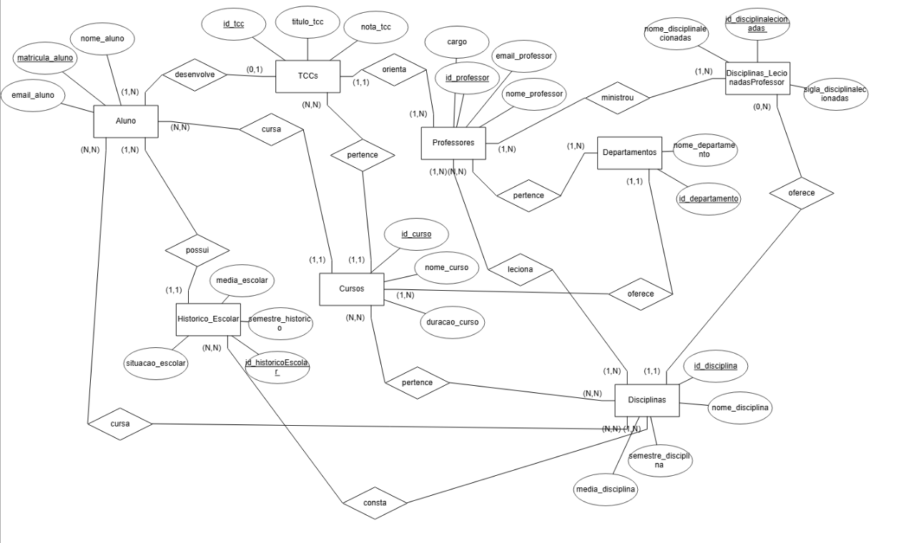

# Banco de dados para uma universidade
## Integrantes

Nome: João Pedro Sabino Garcia - RA: 22.224.032-7

Nome: Matheus Dourado Valle - RA: 22.224.023-6 

## Descrição do Projeto
Este projeto visa implementar um sistema de gerenciamento acadêmico universitário através de um banco de dados estruturado. Ele permite armazenar, gerenciar e consultar informações relacionadas a:

Alunos: informações pessoais, matrícula, curso matriculado e TCC relacionado.

Professores: dados pessoais, disciplinas ministradas, departamento associado e cargo (Chefe, Coordenador ou Nenhum).

Cursos: dados gerais dos cursos, duração e departamento ao qual pertencem.

Disciplinas: disciplinas específicas para cada curso, informações como média exigida e semestre em que são ofertadas.

Departamentos: áreas acadêmicas que agrupam cursos relacionados.

Histórico Escolar: registro detalhado da vida acadêmica dos alunos, incluindo disciplinas cursadas, médias obtidas e situação (aprovado ou reprovado).

TCCs: trabalhos de conclusão de curso atribuídos aos alunos e orientados pelos professores.

As funcionalidades principais do banco de dados incluem cadastro automatizado, criação de relações entre entidades, histórico escolar detalhado e consultas avançadas para análise e gestão acadêmica.

## Como Executar o Projeto

Para rodar o projeto e gerar os dados no seu banco de dados do Supabase, siga os passos detalhados abaixo:
- Certifique-se de ter o Python instalado em sua máquina, e utilize alguma plataforma para rodar o código (Visual Studio Code, Replit, etc.).
- Acesse o SupaBase como Banco de Dados para armazenar as informações geradas pelo código.
- Copie a URL do seu projeto Supabase e a chave pública (public key), pois você precisará inserir essas informações no código.
- No banco de dados, crie as tabelas a partir da querie de criação presente no repositório na pasta "QueriesTables".
- Após colocar as informações do seu banco no código, execute-o.

O script fará o seguinte automaticamente:

- Limpará as tabelas existentes no banco de dados, respeitando as relações de FK.
- Inserirá dados fictícios automaticamente (alunos, professores, departamentos, disciplinas, cursos, históricos escolares, histórico de disciplinas lecionadas por professores e TCCs).
- Fará todas as relações necessárias, conforme os requisitos e as queries.
- Exibirá no terminal um log indicando o progresso e a confirmação da execução.

Após isso:
- O banco será capaz de executar no SQL Editor 15 queries relacionadas ao projeto presentes no repositório pasta "Queries".

## Modelo Entidade Relacional

## Modelo Relacional

  
